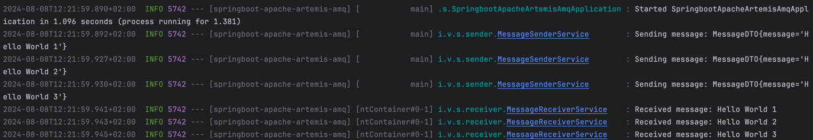

# SpringBoot Apache Artemis AMQ

Simple SpringBoot microservice with Apache Artemis AMQ integration.
The microservice have dual role (for this case study):

- **sender**: send message through JMS template;
- **receiver**: receive message through JMS listener.

For the purpose of this example, suppose that SpringBoot application are two distinct services.
In real scenario, there are two microservices, one that act ad sender and another that act as
receiver.

## Build application

Run from CLI the below maven command.

```bash
mvn clean package
```

## Run Apache Artemis AMQ

Execute [start_artemis.sh](start_artemis.sh) script, this start Apache Artemis AMQ in a Docker container.

```bash
./start_artemis.sh
```

## Run SpringBoot application

Execute jar
file [springboot-apache-artemis-amq-0.0.1-SNAPSHOT.jar](target/springboot-apache-artemis-amq-0.0.1-SNAPSHOT.jar)

```bash
java -jar target/springboot-apache-artemis-amq-0.0.1-SNAPSHOT.jar
```

## Check application status

If all is done, in the IDE console you can see logs like below:



### Reference Documentation

For further reference, please consider the following sections:

* [Official Apache Maven documentation](https://maven.apache.org/guides/index.html)
* [Spring Boot Maven Plugin Reference Guide](https://docs.spring.io/spring-boot/docs/3.3.1/maven-plugin/reference/html/)
* [Create an OCI image](https://docs.spring.io/spring-boot/docs/3.3.1/maven-plugin/reference/html/#build-image)
* [Spring for Apache ActiveMQ Artemis](https://docs.spring.io/spring-boot/docs/3.3.1/reference/htmlsingle/index.html#messaging.jms.artemis)
* [Spring Web](https://docs.spring.io/spring-boot/docs/3.3.1/reference/htmlsingle/index.html#web)

### Guides

The following guides illustrate how to use some features concretely:

* [Messaging with JMS](https://spring.io/guides/gs/messaging-jms/)
* [Building a RESTful Web Service](https://spring.io/guides/gs/rest-service/)
* [Serving Web Content with Spring MVC](https://spring.io/guides/gs/serving-web-content/)
* [Building REST services with Spring](https://spring.io/guides/tutorials/rest/)